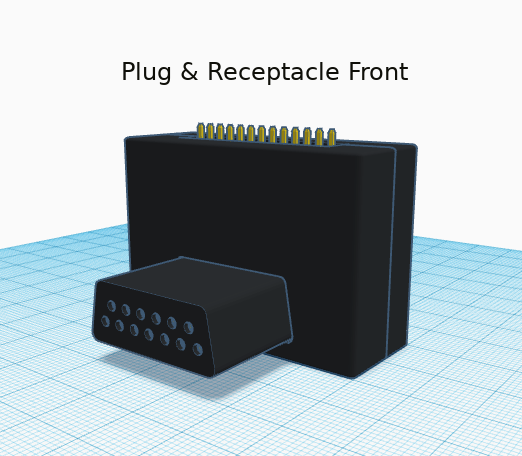

# atari-sio-breakout
This repository contains design files for an Atari SIO breakout board using FujiNet Connectors

# LICENSE
This design is released under the CERN Open Hardware Licence Version 2 available in this repository

# Details
The PCB design was created with Diptrace 3.3.1.3 and there is no schematic, just the layout file. 

All 13 Atari SIO pins are connected from one side to the other and it has a 2.54mm right angle male header on top so you can tap into the bus signals. Hookup your logic analyzer or oscilloscope to the header for debugging your SIO project.

The receptacle pins used in this version have a better fit with all SIO cable styles. There are SMD and Through-hole pads on the pcb if you want to add a capacitor for the 5V power line. The board can be configured in one of two ways:
 * Plug and Receptacle: plug connects to any SIO receptacle and has a receptacle for connecting your SIO cable
   * 
 * Dual Receptacle: requires use of 2 SIO cables for pass through. also doubles as a cable extender
   *  

# Bill Of Materials
 * SIO Plug Pins: 7-745288-2
 * SIO Receptacle Pins: AT60-202-2031
